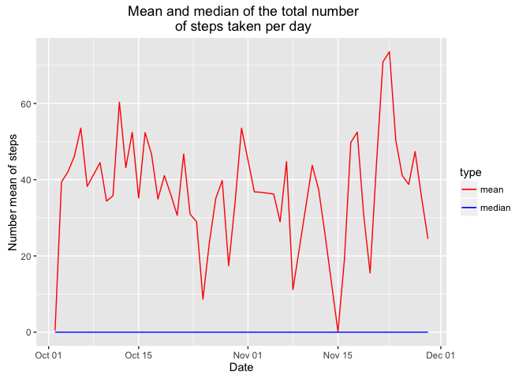
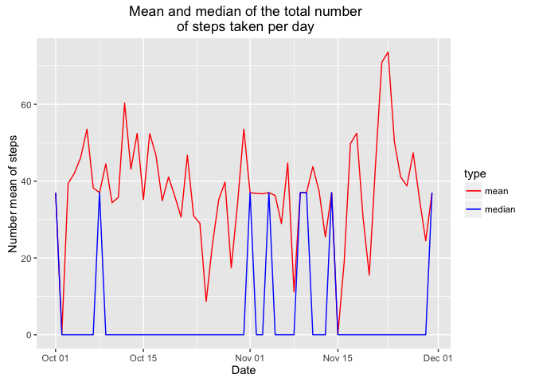

# Reproducible Research: Peer Assessment 1


```r
library(knitr)
#Set global options.
opts_chunk$set(echo=TRUE,results="hide",message=FALSE)
```


## Loading and preprocessing the data


```r
activity <- read.csv("activity.csv")
#Transform the factor as date format.
activity$date<-as.Date(activity$date, format = "%Y-%m-%d")
```


## What is mean total number of steps taken per day?


```r
#Histogram plot function created to be reused later.
histgramPlot <- function(activity){
        #(1) Sum steps group by date.
        numStepsByDay <- activity %>% group_by(date) %>% summarise(numSteps = sum(steps))
        #(2) Plot the histogram of steps.
        ggplot(numStepsByDay,aes(numSteps)) + geom_histogram(na.rm = TRUE,color="black",fill="white",binwidth = 1000)+ggtitle("Histogram of the total number \n of steps taken each day")+labs(x="Number of steps",y="Frequency")
}
# Histogram of the total number of steps taken each day.
histgramPlot(activity)
```

<!-- -->

```r
#(3) Mean and median of the total number of steps taken per day
meanMedianPlot <- function(activity){
        meanMedianByDay <- activity  %>% filter(!is.na(steps)) %>% group_by(date) %>% summarise(mean=mean(steps),median = median(steps))
        ggplot(meanMedianByDay,aes(date)) + geom_line(aes(y=mean,color="mean")) + geom_line(aes(y=median,color="median"))+ scale_colour_manual("type", breaks = c("mean", "median"), values = c("red", "blue")) + labs(x="Date",y="Number mean of steps") +ggtitle(" Mean and median of the total number\n of steps taken per day")        
}
meanMedianPlot(activity)
```

<!-- -->

## What is the average daily activity pattern?

```r
meanMedianByDay <- activity  %>% filter(!is.na(steps)) %>% group_by(date) %>% summarise(mean=mean(steps),median = median(steps))
#(1) Average steps time series.
ggplot(meanMedianByDay,aes(x=date,y=mean))+geom_line()+ggtitle("Time series of average number \nof steps taken accross all days")+labs(x="Time",y="Mean steps")
```

<!-- -->

```r
#(2)Max mean number of steps across all days
maxNumSteps <- with(meanMedianByDay,date[mean==max(meanMedianByDay$mean)])
```

The date contains max number of steps: 2012-11-23

## Imputing missing values

```r
#(1) Total number of missing values in the dataset.
countNA <- sum(is.na(activity$steps))
```

Total number of missing values: 2304


```r
#(2) Filling the missing values by mean value.
meanValue <- as.integer(mean(activity$steps,na.rm=TRUE))
activityNoNA <- activity
activityNoNA[is.na(activityNoNA$steps),"steps"] <- meanValue
histgramPlot(activityNoNA)
```

<!-- -->

```r
meanMedianPlot(activityNoNA)
```

<!-- -->


## Are there differences in activity patterns between weekdays and weekends?

```r
workdingWeekDays <- c('Monday', 'Tuesday', 'Wednesday', 'Thursday', 'Friday')
activityNoNA$weekdayType <- c('weekend', 'weekday')[(weekdays(activityNoNA$date) %in% workdingWeekDays)+1L]
ggplot(activityNoNA,aes(x=interval,y=steps)) + geom_line() + facet_wrap(~weekdayType,ncol=1) + labs(y="Number of steps", x="Iterval")
```

<!-- -->

