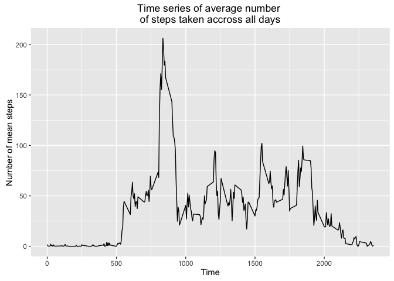
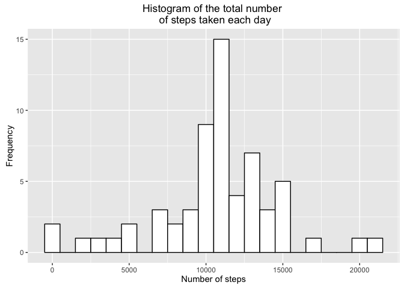

# Reproducible Research: Peer Assessment 1


```r
library(knitr)
#Set global options.
opts_chunk$set(echo=TRUE,results="hide",message=FALSE)
```


## Loading and preprocessing the data


```r
activity <- read.csv("activity.csv",stringsAsFactors = FALSE)
#Transform the factor as date format.
activity$date<-as.Date(activity$date, format = "%Y-%m-%d")
```


## What is mean total number of steps taken per day?


```r
# Histogram of the total number of steps taken each day.
#(1) Sum steps group by date.
numStepsByDay <- activity %>% group_by(date) %>% summarise(numSteps = sum(steps))
#(2) Plot the histogram of steps.
ggplot(numStepsByDay,aes(numSteps)) + geom_histogram(na.rm = TRUE,color="black",fill="white",binwidth = 1000)+ggtitle("Histogram of the total number \n of steps taken each day")+labs(x="Number of steps",y="Frequency")
```

<!-- -->

```r
#(3) Mean and median of the total number of steps taken per day
stepsMean <- mean(numStepsByDay$numSteps,na.rm=TRUE)
stepsMedian <- median(numStepsByDay$numSteps,na.rm=TRUE)
```
Mean and median of number of steps are 1.0766189\times 10^{4} and 10765

## What is the average daily activity pattern?

```r
meanStepsByDay <- activity %>% group_by(interval) %>% summarise(meanSteps=mean(steps,na.rm=TRUE))
#(1) Average steps time series.
ggplot(meanStepsByDay,aes(x=interval,y=meanSteps))+geom_line()+ggtitle("Time series of average number \nof steps taken accross all days")+labs(x="Time",y="Number of mean steps")
```

<!-- -->

```r
#(2)Max mean number of steps across all days
maxNumSteps <- with(meanStepsByDay,interval[meanSteps==max(meanSteps)])
```

The date contains max number of steps: 835

## Imputing missing values

```r
#(1) Total number of missing values in the dataset.
countNA <- sum(is.na(activity$steps))
```

Total number of missing values: 2304


```r
#(2) Filling the missing values by mean value.
meanValue <- as.integer(mean(activity$steps,na.rm=TRUE))
activityNoNA <- activity
activityNoNA[is.na(activityNoNA$steps),"steps"] <- meanValue
numStepsByDayNoNA <- activityNoNA %>% group_by(date) %>% summarise(numSteps = sum(steps))
#(3) Plot the histogram of steps.
ggplot(numStepsByDayNoNA,aes(numSteps)) + geom_histogram(na.rm = TRUE,color="black",fill="white",binwidth = 1000)+ggtitle("Histogram of the total number \n of steps taken each day")+labs(x="Number of steps",y="Frequency")
```

<!-- -->

```r
#(4) Mean and median of the total number of steps taken per day
stepsMeanNoNA <- mean(numStepsByDayNoNA$numSteps,na.rm=TRUE)
stepsMedianNoNA <- median(numStepsByDayNoNA$numSteps,na.rm=TRUE)
```

Mean and median of number of steps after missing values filled in are 1.0751738\times 10^{4} and 10656

## Are there differences in activity patterns between weekdays and weekends?

```r
workdingWeekDays <- c('Monday', 'Tuesday', 'Wednesday', 'Thursday', 'Friday')
activityNoNA$weekdayType <- c('weekend', 'weekday')[(weekdays(activityNoNA$date) %in% workdingWeekDays)+1L]
meanStepsByWeekday <- activityNoNA  %>% filter(!is.na(steps)) %>% group_by(weekdayType,interval) %>% summarise(meanSteps=mean(steps))
ggplot(meanStepsByWeekday,aes(x=interval,y=meanSteps)) + geom_line() + facet_wrap(~weekdayType,ncol=1) + labs(y="Number of steps", x="Interval")
```

<!-- -->

